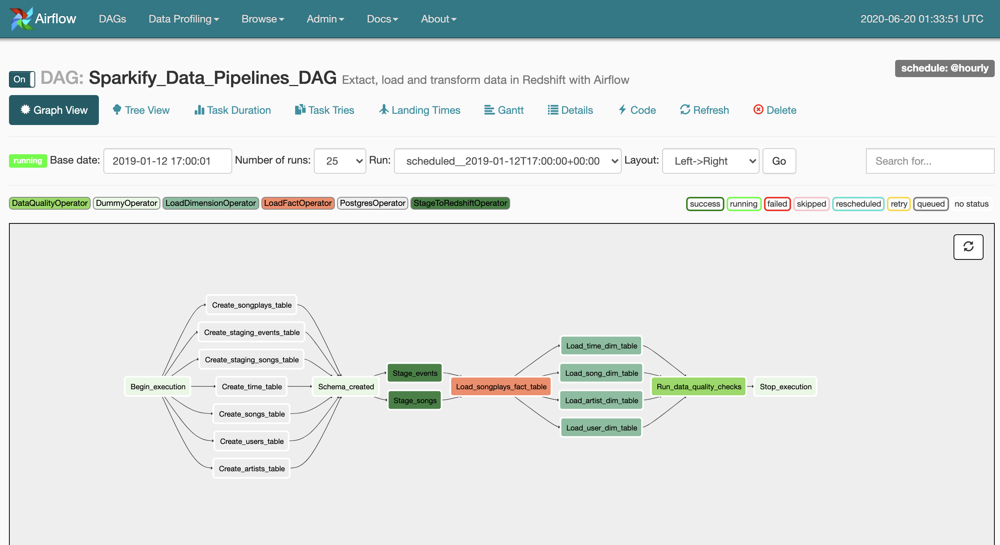
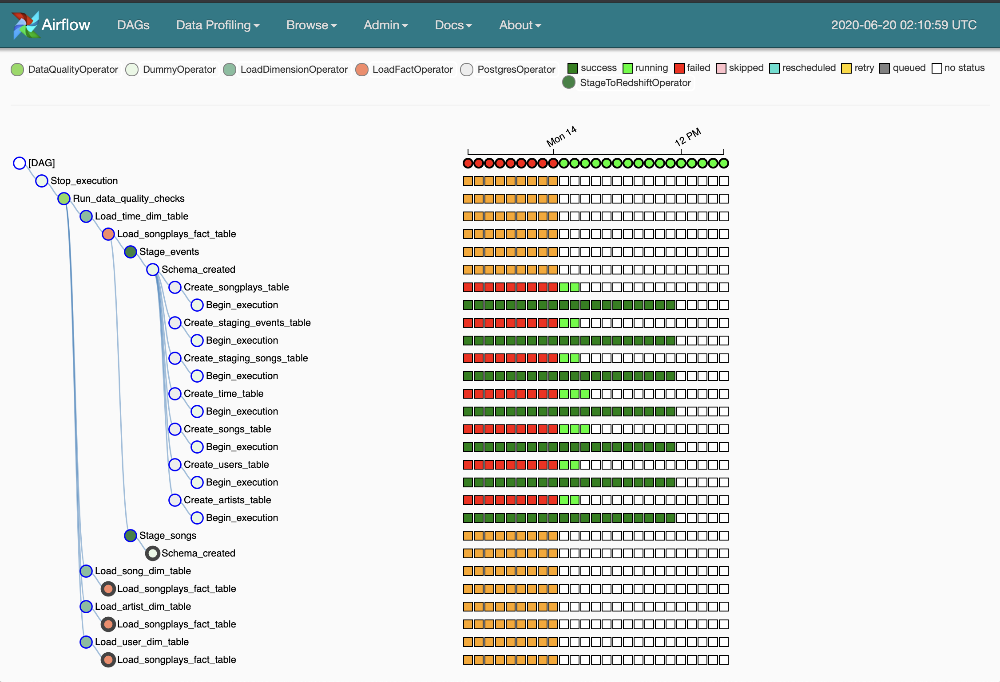

# Data Pipelines - Airflow
## Table of Contents
### Introduction
	A music streaming company, Sparkify, has decided that it is time to introduce more automation and monitoring to their data warehouse ETL pipelines and come to the conclusion that the best tool to achieve this is Apache Airflow.
    The source data resides in S3 and needs to be processed in Sparkify's data warehouse in Amazon Redshift. The source datasets consist of JSON logs that tell about user activity in the application and JSON metadata about the songs the users listen to.

  
### Project Description
	This project will introduce you to the core concepts of Apache Airflow. To complete the project, you will need to create your own custom operators to perform tasks such as staging the data, filling the data warehouse, and running checks on the data as the final step.
	We have provided you with a project template that takes care of all the imports and provides four empty operators that need to be implemented into functional pieces of a data pipeline. The template also contains a set of tasks that need to be linked to achieve a coherent and sensible data flow within the pipeline.
	You'll be provided with a helpers class that contains all the SQL transformations. Thus, you won't need to write the ETL yourselves, but you'll need to execute it with your custom operators.

### Project structure explanation
```
workspace
│   README.md                    # Project description
│   
└───airflow                      # Airflow home
|   |               
│   └───dags                     
│   |   │ udac_example_dag.py    # DAG definition
|   |   |
|   |   └───images
|   |       | Sparkify_DAG.png   # DAG image
|   |       
|   | 
|   └───plugins
│       │  
|       └───helpers
|       |   | sql_queries.py     # All sql queries needed
|       |
|       └───operators
|       |   | data_quality.py    # DataQualityOperator
|       |   | load_dimension.py  # LoadDimensionOperator
|       |   | load_fact.py       # LoadFactOperator
|       |   | stage_redshift.py  # StageToRedshiftOperator
```
   
Airflow UI is allows any users to visualize the DAG in a graph view. The author of a data pipeline must define the structure of dependencies among tasks in order to visualize them. This specification is often written in a file called the DAG definition file, which lays out the anatomy of an Airflow job. While DAGs describe how to run a data pipeline, operators describe what to do in a data pipeline. 
